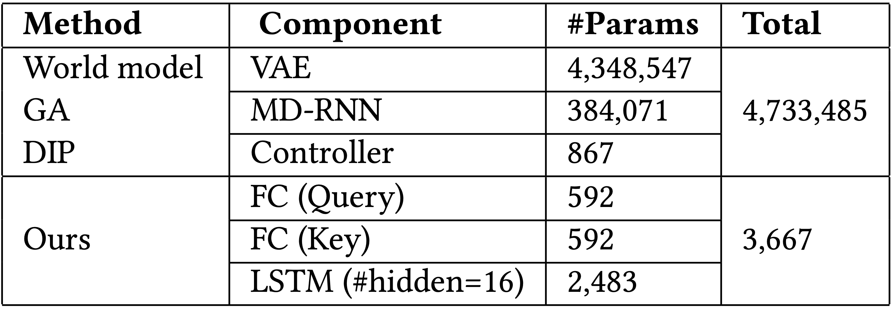
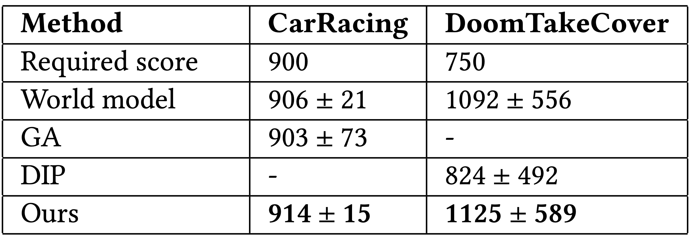
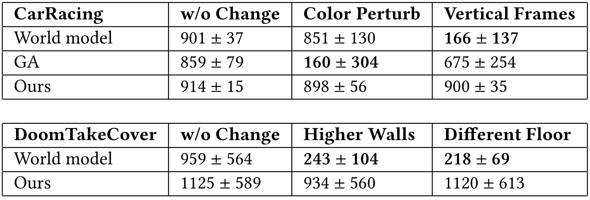

## Abstract 

While reinforcement learning methods in existing literature can solve many vision based tasks, it is often difficult to understand an agent’s policy without using dedicated tools for interpretability.
In this paper, we investigate the use of self-attention to create agents that observe its environment similarly to how humans see the world. By constraining agents to access only a small fraction of its visual input, we show that their policies are directly interpretable in pixel space.
We demonstrate that neuroevolution is ideal for training self-attention architectures for RL tasks, because we can remove unnecessary complexity needed for gradient-based methods, resulting in a much simpler architecture, and also allowing us to incorporate modules that can include discrete, non-differentiable operations that are useful for our agent.
We argue that self-attention has similar properties as indirect encoding methods, in the sense that large implicit weight matrices are generated from a small number of key-query parameters, thus enabling our agent to solve challenging vision based tasks with at least 1000x fewer parameters than existing methods.
Since our agent learns to attend to only task critical visual hints, they are able to generalize to environments where task irrelevant elements are modified while conventional methods fail.

______

## Experiments

This article contains supplementary videos that accompany Section 5 of our paper. Our goal in Section 5 is to answer the following questions via experiments and analysis:

- Is our agent able to solve challenging vision-based RL tasks? If so, what are the advantages over other methods that solved the same tasks?

- How robust is the learned agent? If the agent is focusing on task critical factors, does it generalize to the environments with modifications that are irrelevant to the core mission?

## Task Description

We evaluate our method in two vision-based RL tasks: CarRacing<dt-cite key="CarRacing-v0"></dt-cite> and DoomTakeCover<dt-cite key="DBLP:conf/cig/KempkaWRTJ16,DoomTakeCover-v0"></dt-cite>. The below figure are videos of our self-attention agent performing these two tasks:

<table style="width: 100%;" cellspacing="0" cellpadding="0"><tr>
<td style="width: 60%;border: 1px solid transparent;"><video class="b-lazy" data-src="assets/mp4/carracing_nomod_ours.mp4" type="video/mp4" autoplay muted playsinline loop style="width: 95%;" ></video></td>
<td style="width: 40%;border: 1px solid transparent;"><video src="assets/mp4/carracing_nomod_ours_att.mp4" type="video/mp4" autoplay muted playsinline loop style="width: 95%;" ></video></td>
</tr>
</table>
<table style="width: 100%;" cellspacing="0" cellpadding="0"><tr>
<td style="width: 60%;border: 1px solid transparent;"><video class="b-lazy" data-src="assets/mp4/takecover_nomod_ours.mp4" type="video/mp4" autoplay muted playsinline loop style="width: 95%;" ></video></td>
<td style="width: 40%;border: 1px solid transparent;"><video src="assets/mp4/takecover_nomod_ours_att.mp4" type="video/mp4" autoplay muted playsinline loop style="width: 95%;" ></video></td>
</tr>
</table>
<figcaption style="text-align: left; color:#FF6C00; padding-top: 0;">Self-attention agent playing CarRacing and DoomTakeCover.</figcaption>
<figcaption style="text-align: left; padding-top: 0;">
Left: Screenshot of actual game environment presented to humans. Right: Resized images presented to our agent as visual input, and also its attention highlighted in white patches. 
</figcaption>

In CarRacing, the agent controls three continuous actions (steering left/right, acceleration and brake) of the red car to visit as many randomly generated track tiles as possible in limited steps.
At each step, the agent receives a penalty of $-0.1$ but will be rewarded with a score of $+\frac{1000}{n}$ for every track tile it visits where $n$ is the total number of tiles.
Each episode ends either when all the track tiles are visited or when 1000 steps have passed.
CarRacing is considered solved if the average score over 100 consecutive test episodes is higher than 900.
Numerous works have tried to tackle this task with Deep RL algorithms,
but it is not solved until recently by <dt-cite key="ha2018worldmodels,DBLP:conf/gecco/RisiS19,DBLP:journals/corr/abs-2001-01683"></dt-cite> by methods we will refer to as <dt-cite key="ha2018worldmodels">World Model</dt-cite>, <dt-cite key="DBLP:conf/gecco/RisiS19">Genetic Algorithm (GA)</dt-cite> and <dt-cite key="DBLP:journals/corr/abs-2001-01683">Deep Innovation Protection (DIP)</dt-cite>.

<figcaption style="text-align: left; padding-top: 0;">
<b>Learnable Parameters&nbsp;</b> GA, DIP share the same world model architecture. The <i>genotype</i> in our indirect-encoding self-attention module are the fully connected (FC) layers that include corresponding bias terms, and the agent's controller is a small LSTM. 
</figcaption>

VizDoom serves as a platform for the development of intelligent agents that play DOOM using visual information, of which DoomTakeCover is a task where the agent is required to dodge the fireballs shot by the monsters and stay alive as long as possible.
Each episode lasts for 2100 steps but ends early if the agent is dead from being shot.
This is a discrete control problem where the agent can choose to move left/right or stay still at each step.
The agent gets a reward of $+1$ for each step it survives, and the task is regarded solved if the average accumulated reward over 100 episodes is larger than 750.
While a pre-trained <dt-cite key="ha2018worldmodels">world model</dt-cite> is able to solve both CarRacing and this task, it has been reported that the end-to-end direct-encoding <dt-cite key="DBLP:conf/gecco/RisiS19">Genetic Algorithm (GA)</dt-cite> proposed by Risi and Stanley falls short at solving this task without incorporating multi-objective optimization to preserve diversity, in <dt-cite key="DBLP:journals/corr/abs-2001-01683">Deep Innovation Protection (DIP)</dt-cite>.

## Results

Not only is our agent able to solve both tasks, it also outperformed existing methods. Here is a summary of our agent's results:

<figcaption style="text-align: left; padding-top: 0;">
<b>CarRacing and DoomTakeCover Results&nbsp;</b> We report the average score over 100 consecutive tests with standard deviations.
For reference, the required scores above which the tasks are considered solved are also included. Best scores are highlighted. 
</figcaption>

Our agent is also self-interpretable in the pixel space.
In the following video, we visualize the our agent's attention by plotting the top $K$ important patches elected by the self-attention module on top of the input image and see directly what the agent is attending to (see the accompanying videos for more results).
The opaqueness indicates the importance, the whiter the more important.

<table style="width: 100%;" cellspacing="0" cellpadding="0"><tr>
<td style="width: 50%;border: 1px solid transparent;"><video src="assets/mp4/carracing_nomod_ours_att.mp4" type="video/mp4" autoplay muted playsinline loop style="width: 95%;" ></video></td>
<td style="width: 50%;border: 1px solid transparent;"><video src="assets/mp4/takecover_nomod_ours_att.mp4" type="video/mp4" autoplay muted playsinline loop style="width: 95%;" ></video></td>
</tr>
</table>
<figcaption style="text-align: left; padding-top: 0;">
CarRacing and DoomTakeCover attention patches. 
</figcaption>

From visualizing the patches and observing the agent's attention, we notice that most of the patches the agent attends to are consistent with humans intuition.
For example in CarRacing, the agent's attention is on the border of the road but shifts its focus to the turns before the car needs to change its heading direction.
Notice the attentions are mostly on the left side of the road, this makes sense from a statistical point of view considering that the racing lane forms a closed loop and the car is always running in a counter-clockwise direction.
In DoomTakeCover, the agent is able to focus its attention on fireballs.
When the agent is near the corner of the room, it is also able to detect the wall and change its dodging strategy instead of stuck into the dead end.
Notice the agent also distributes its attention on the panel at the bottom, especially on the profile photo in the middle.
We suspect this is because the controller is using patch positions as its input, and it learned to use these points as anchors to estimate its distances to the fireballs.
We also notice that the scores from all methods have large variance in DoomTakeCover.
This seems to be caused by the environment's design: some fireballs might be out of the agent's sight but are actually approaching, the agent can be hit by them when it's dodging other fireballs that are in the vision.

Through these tasks, we are able to give a positive answer to the first question, *is our agent able to solve challenging vision-based RL tasks? If so, what are the advantages over other methods that solved the same tasks?*
Our agent is able to solve challenging vision-based RL tasks, it is efficient in terms of being able to reach higher scores with significantly fewer parameters.
Furthermore, it is self-interpretable and reasons coherently as humans do because it is able to make decisions based on spatial information extracted from visual inputs.

## Generalize to Modified Environments

To test our agent's robustness and its ability to generalize to novel states,
we test the learned agent in modified CarRacing and DoomTakeCover *without* re-training or fine-tuning.
While there are infinitely many ways to modify an environment,
our modifications respect one important principle: the modifications should not cause changes of the core mission or critical information loss.
With this design principle in mind we present the following modifications:

- **CarRacing--Color Perturbation&nbsp;** We randomly perturb the background color. At the beginning of each episode we sample two 3D vectors as perturbations uniformly from the interval $[-0.2, 0.2]$ and add respectively to the lane and grass field RGB vectors. The perturbed colors remain constant throughout an episode.

<table style="width: 100%;" cellspacing="0" cellpadding="0">
<tr>
<td style="width: 50%;border: 1px solid transparent;"><video src="assets/mp4/carracing_nomod_ours_att.mp4" type="video/mp4" autoplay muted playsinline loop style="width: 95%;" ></video></td>
<td style="width: 50%;border: 1px solid transparent;"><video class="b-lazy" data-src="assets/mp4/carracing_mod1_ours_att.mp4" type="video/mp4" autoplay muted playsinline loop style="width: 95%;" ></video></td>
</tr>
</table>
<figcaption style="text-align: left;">
Original Environment (Score: 914±15) vs Color Perturbation (Score: 898±56) 
</figcaption>
 
<table style="width: 100%;" cellspacing="0" cellpadding="0">
<tr>
<td style="width: 33.3%;border: 1px solid transparent;"><video class="b-lazy" data-src="assets/mp4/carracing_mod1_wm.mp4" type="video/mp4" autoplay muted playsinline loop style="width: 95%; padding-top: 0;" ></video></td>
<td style="width: 33.3%;border: 1px solid transparent;"><video class="b-lazy" data-src="assets/mp4/carracing_mod1_ga.mp4" type="video/mp4" autoplay muted playsinline loop style="width: 95%; padding-top: 0;" ></video></td>
<td style="width: 33.3%;border: 1px solid transparent;"><video class="b-lazy" data-src="assets/mp4/carracing_mod1_ours.mp4" type="video/mp4" autoplay muted playsinline loop style="width: 95%; padding-top: 0;" ></video></td>
</tr>
<tr>
<td style="width: 33.3%;border: 1px solid transparent;"><figcaption style="text-align: left; padding-top: 0;">World Models (Score: 851±130)</figcaption></td>
<td style="width: 33.3%;border: 1px solid transparent;"><figcaption style="text-align: left; padding-top: 0;">GA (Score: 160±304)</figcaption></td>
<td style="width: 33.3%;border: 1px solid transparent;"><figcaption style="text-align: left; padding-top: 0;">Ours (Score: 898±56)</figcaption></td>
</tr>
</table>

 

- **CarRacing--Vertical Frames&nbsp;** We add black vertical bars to the left and right sides of the screen. The window size of CarRacing is 800px × 1000px, we add two vertical bars of width 75px on the two sides of the window.

<table style="width: 100%;" cellspacing="0" cellpadding="0">
<tr>
<td style="width: 50%;border: 1px solid transparent;"><video src="assets/mp4/carracing_nomod_ours_att.mp4" type="video/mp4" autoplay muted playsinline loop style="width: 95%;" ></video></td>
<td style="width: 50%;border: 1px solid transparent;"><video class="b-lazy" data-src="assets/mp4/carracing_mod2_ours_att.mp4" type="video/mp4" autoplay muted playsinline loop style="width: 95%;" ></video></td>
</tr>
</table>
<figcaption style="text-align: left;">
Original Environment (Score: 914±15) vs Vertical Frames (Score: 900±35) 
</figcaption>
 
<table style="width: 100%;" cellspacing="0" cellpadding="0">
<tr>
<td style="width: 33.3%;border: 1px solid transparent;"><video class="b-lazy" data-src="assets/mp4/carracing_mod2_wm.mp4" type="video/mp4" autoplay muted playsinline loop style="width: 95%; padding-top: 0;" ></video></td>
<td style="width: 33.3%;border: 1px solid transparent;"><video class="b-lazy" data-src="assets/mp4/carracing_mod2_ga.mp4" type="video/mp4" autoplay muted playsinline loop style="width: 95%; padding-top: 0;" ></video></td>
<td style="width: 33.3%;border: 1px solid transparent;"><video class="b-lazy" data-src="assets/mp4/carracing_mod2_ours.mp4" type="video/mp4" autoplay muted playsinline loop style="width: 95%; padding-top: 0;" ></video></td>
</tr>
<tr>
<td style="width: 33.3%;border: 1px solid transparent;"><figcaption style="text-align: left; padding-top: 0;">World Models (Score: 166±137)</figcaption></td>
<td style="width: 33.3%;border: 1px solid transparent;"><figcaption style="text-align: left; padding-top: 0;">GA (Score: 675±254)</figcaption></td>
<td style="width: 33.3%;border: 1px solid transparent;"><figcaption style="text-align: left; padding-top: 0;">Ours (Score: 900±35)</figcaption></td>
</tr>
</table>

 

- **DoomTakeCover--Higher Walls&nbsp;** We make the wall higher and keep all other settings.

<table style="width: 100%;" cellspacing="0" cellpadding="0">
<tr>
<td style="width: 50%;border: 1px solid transparent;"><video src="assets/mp4/takecover_nomod_ours_att.mp4" type="video/mp4" autoplay muted playsinline loop style="width: 95%;" ></video></td>
<td style="width: 50%;border: 1px solid transparent;"><video class="b-lazy" data-src="assets/mp4/takecover_mod1_ours_att.mp4" type="video/mp4" autoplay muted playsinline loop style="width: 95%;" ></video></td>
</tr>
</table>
<figcaption style="text-align: left; padding-top: 0;">
Original Environment (Score: 1125±589) vs Higher Walls (Score: 934±560) 
</figcaption>
 
<video src="assets/mp4/takecover_mod1_wm_all.mp4" type="video/mp4" autoplay muted playsinline loop style="width: 97.5%;"></video>
<figcaption style="text-align: left; padding-top: 0;">
World model baseline (Score: 243±104) 
<i>Left:</i> Rendering of modified game environment. 
<i>Center:</i> Agent's visual input. 
<i>Right:</i> Reconstruction of what the baseline agent actually sees, based on its world model trained only on the original environment.
</figcaption>

 

- **DoomTakeCover--Different Floor Texture&nbsp;** We change the texture of the floor and keep all other settings.

<table style="width: 100%;" cellspacing="0" cellpadding="0">
<tr>
<td style="width: 50%;border: 1px solid transparent;"><video src="assets/mp4/takecover_nomod_ours_att.mp4" type="video/mp4" autoplay muted playsinline loop style="width: 95%;" ></video></td>
<td style="width: 50%;border: 1px solid transparent;"><video class="b-lazy" data-src="assets/mp4/takecover_mod2_ours_att.mp4" type="video/mp4" autoplay muted playsinline loop style="width: 95%;" ></video></td>
</tr>
</table>
<figcaption style="text-align: left; padding-top: 0;">
Original Environment (Score: 1125±589) vs Different Floor Texture (Score: 1120±613) 
</figcaption>
 
<video src="assets/mp4/takecover_mod2_wm_all.mp4" type="video/mp4" autoplay muted playsinline loop style="width: 97.5%;"></video>
<figcaption style="text-align: left; padding-top: 0;">
World model baseline (Score: 218±69) 
<i>Left:</i> Rendering of modified game environment. 
<i>Center:</i> Agent's visual input. 
<i>Right:</i> Reconstruction of what the baseline agent actually sees, based on its world model trained only on the original environment.
</figcaption>

 

For the purpose of comparison, we used the released code (and pre-trained models, if available) from <dt-cite key="ha2018worldmodels,DBLP:conf/gecco/RisiS19"></dt-cite> as baselines.
While our reproduced numbers do not exactly match the reported scores, they are within error bounds, and close enough for the purpose of testing for generalization.
For each modification, we test a trained agent for 100 consecutive episodes and report its scores in the following table:

<figcaption style="text-align: left;">
<b>Generalization Experiments&nbsp;</b> We train agents in the original task and test in the modified environments without re-training. Agents' performance in the unmodified tasks are included for reference. Results with significant performance drop highlighted. 
</figcaption>

Our agent generalizes well to all modifications while the baselines fail.
To be concrete, World model is able to maintain its performance in color perturbations in CarRacing but is sensitive to all other changes.
Specifically, we observe $> 75\%$ score drops in Vertical Frames, Higher Walls and Different Floor from its performances in the unmodified tasks.
World model's controller used as input the abstract representations it learned from reconstructing the input images.
Without much regularization it is likely that the learned representations will encode visual information that is crucial to image reconstruction but not task critical.
If this to-be-encoded visual information is modified in the input space, the model produces misleading representations for the controller and we see performance drops.
Although trained with neuroevolution, GA adopts the same model architecture as World model. In CarRacing, GA suffers from the marginal screen occlusion, but its performance degrade is more obvious in color perturbations, the score dropped significantly from 859 to 160.
On the other hand, our agent showed no performance drop that is statistically significant, additionally standard deviations also match those in the unmodified tasks. 

Through these tests, we are able to answer the second question posed earlier, *how robust is the learned agent? If the agent is focusing on task critical factors, does it generalize to the environments with modifications that are irrelevant to the core mission?*
The small change in score standard deviations proves that our agent is robust.
Unlike baseline methods, our agent focuses only task critical factors, it is thus able to generalize to novel states unseen during its training. 

## Conclusion and Future Work

The paper demonstrated that self-attention is a powerful module for creating RL agents that is capable of solving challenging vision-based tasks.
Our agent achieves state of the art results on CarRacing and DoomTakeCover with significantly fewer parameters than conventional methods, and is easily interpretable in pixel space.
Trained with neuroevolution, the agent learned to devote most of its attention to visual hints that are task critical and is therefore able to generalize to environments where task irrelevant elements are modified while conventional methods fail.

Neuroevolution is a powerful toolbox for training intelligent agents, yet its adoption in RL is limited because its effectiveness when applied to large deep models was not clear until only recently <dt-cite key="such2017deep,DBLP:conf/gecco/RisiS19"></dt-cite>.
We find neuroevolution to be ideal for learning agents with self-attention.
It allows us to produce a much smaller model by removing unnecessary complexity needed for gradient-based method.
In addition, it also enables the agent to incorporate modules that include discrete and non-differentiable operations that are helpful for the tasks.
With such small yet capable models, it is exciting to see how neuroevolution trained agents would perform in vision-based tasks that are currently dominated by Deep RL algorithms in the existing literature.

In this work, we also establish the connections between indirect encoding methods and self-attention.
Specifically, we show that self-attention can be viewed as a form of indirect encoding.
Another interesting direction for future works is therefore to explore more specific forms of indirect encoding that, when combined with neuroevolution, can produce parameter efficient RL agents.
