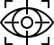

## Acknowledgements

This article was prepared using the [Distill](https://distill.pub) [template](https://github.com/distillpub/template).

&nbsp;&nbsp;Vision icon by artist <a href="https://thenounproject.com/kukkik_jung/">monkik</a>.

## Open Source Code

Code to reproduce results in this work will be released upon the paper's publication.

## Reuse

Diagrams and text are licensed under Creative Commons Attribution [CC-BY 4.0](https://creativecommons.org/licenses/by/4.0/) with the [source available on GitHub](https://github.com/geccoanon/geccoanon.github.io), unless noted otherwise. The figures that have been reused from other sources don’t fall under this license and can be recognized by the citations in their caption.
